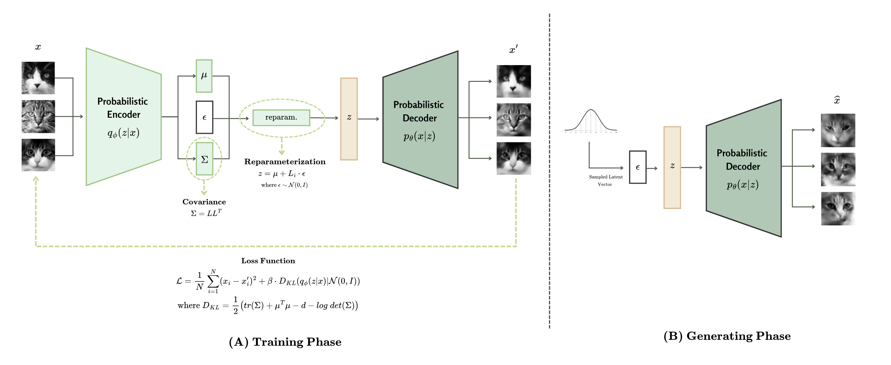

# Variational Autoencoder for Cat Images

This project trains a convolutional Variational Autoencoder (VAE) on cat images and augments its latent space with a Gaussian Mixture Model (GMM) to synthesize new samples. It includes utilities to split the dataset, monitor validation loss, and optionally run large-scale hyperparameter sweeps with Ray Tune.

## Architecture



The model follows an encoder-decoder CNN layout: grayscale cat images pass through stacked convolutional blocks that compress them into a latent vector of size `latent_dim`; the decoder mirrors this structure with transposed convolutions to reconstruct the inputs. A Gaussian Mixture Model is fitted on the latent vectors after training to support guided sampling. Replace `docs/architecture.png` with your own diagram (or update the path) to visualise the flow in documentation.

## Features

-   Convolutional VAE with configurable latent dimensionality.
-   Automatic device selection (CUDA, Apple MPS, or CPU).
-   Train/validation/test split with reconstruction visualizations saved to disk.
-   Optional Gaussian Mixture Model fitting on the latent space for guided sampling.
-   YAML-driven training configuration with type-safe overrides.
-   Ray Tune integration for hyperparameter exploration using an ASHA scheduler.

## Project Structure

-   `main.py`: Entry point for training, evaluation, and Ray Tune integration.
-   `vae/dataset.py`: Dataset helper that downloads (optional) and loads images from a Kaggle cat dataset.
-   `vae/model.py`: VAE definition, training loop, latent-space GMM utilities, and plotting helpers.
-   `data/`: Expected location of raw input images (ignored by Git).
-   `output/`: Generated figures such as reconstructions and synthetic samples.

## Getting Started

### Prerequisites

-   Python 3.10+ is recommended.
-   A GPU is optional but supported (CUDA or Apple Silicon MPS).
-   Kaggle credentials if you want the script to download the dataset for you.

### Installation

```bash
python -m venv .venv
source .venv/bin/activate  # Windows: .venv\Scripts\activate
pip install --upgrade pip
pip install -r requirements.txt
```

The pinned versions cover PyTorch, TorchVision, Ray Tune, scikit-learn, matplotlib, Pillow, and their runtime dependencies. If you need a wheel tailored for CUDA or MPS, edit `requirements.txt` (or reinstall PyTorch) following the [official instructions](https://pytorch.org/get-started/locally/).

### Dataset Setup

By default, `main.py` instantiates `VAEDataset` with `download=False`, so it expects images to already be present under `data/`.

1. **Manual download:** Obtain the [Kaggle Cats dataset](https://www.kaggle.com/borhanitrash/cat-dataset) manually and extract the images into the `data/` directory.
2. **Automatic download:** Set `download=True` when constructing `VAEDataset` (see `main.py`) and make sure your Kaggle API credentials are available as environment variables (`KAGGLE_USERNAME`, `KAGGLE_KEY`). The helper will download the archive, extract images, and clean up temporary files.

Ensure `data/` only contains image files (`.png`, `.jpg`, `.jpeg`, `.bmp`, `.gif`). The dataset loader raises a descriptive error if no images are found.

### Configuration

All runtime options live in `configs/local.yaml`. At startup `main.py` loads this file, materialises a typed configuration object, resolves the `data_dir` / `output_dir` paths to absolute locations relative to the repository, and creates the folders if they do not exist. Any change you make to the YAML is validated on load, so typos surface early.

#### Default configuration (`configs/local.yaml`)

| Key             | Default  | What it controls                                                                                                           |
| --------------- | -------- | -------------------------------------------------------------------------------------------------------------------------- |
| `data_dir`      | `data`   | Folder that must contain the training images. Point it elsewhere if your dataset lives outside the repo.                   |
| `output_dir`    | `output` | Destination for reconstructions, generated samples, and any future reports.                                                |
| `batch_size`    | `128`    | Mini-batch size used for all dataloaders. Lower it if you are memory constrained.                                          |
| `learning_rate` | `1e-3`   | Adam learning rate passed to the optimiser.                                                                                |
| `latent_dim`    | `128`    | Size of the latent space for the VAE encoder/decoder.                                                                      |
| `beta`          | `1e-4`   | Weight applied to the KL term inside the VAE loss. Use this to trade-off reconstruction quality vs. latent regularisation. |
| `epochs`        | `10`     | Number of full passes through the training split.                                                                          |
| `image_size`    | `128`    | Final square resolution (in pixels) after grayscale + resize transforms.                                                   |
| `seed`          | `57`     | When set, seeds PyTorch, NumPy, and dataloader shuffling for reproducibility. Set to `null` to disable seeding.            |
| `download`      | `False`  | Switch to `true` to allow automatic retrieval of the Kaggle cats dataset using your `KAGGLE_USERNAME`/`KAGGLE_KEY`.        |

Additional knobs such as the GMM component count (`n_components`, default `10`) and the balanced subset length (`length`) are configurable programmatically; add them to the YAML if you need to override the defaults handled in `utils/training.py`.

To run with a different profile, copy `configs/local.yaml`, edit the values, and either update the path in `main.py` or pass the file to your own launcher that calls `load_config_from_yaml`.

## Usage

### Run a local training session

1. Activate your environment and install dependencies (see Installation).
2. Update `configs/local.yaml` to match your data location and desired hyperparameters.
3. Place cat images inside the folder referenced by `data_dir`, or set `download: true` and make sure Kaggle credentials are exported.
4. Launch training:

```bash
python main.py
```

During the run the pipeline will:

-   split the dataset into train/validation/test (80/10/10) using the configured seed,
-   train for the requested number of `epochs` while printing loss stats,
-   persist reconstructions to `output/reconstructions.png`,
-   fit a latent-space Gaussian Mixture Model on the training split,
-   and sample new cats into `output/generated.png`.

If you want to override parameters on the fly, update the YAML and re-run. For ad-hoc experiments you can also adapt the dictionary passed to `train_vae` inside `main.py`.

### Hyperparameter Tuning

Uncomment the `hyperparameter_tuning()` call in `main.py` to launch a Ray Tune sweep across learning rate, latent dimension, and epoch counts. Results are reported to the Ray dashboard (if running) and the best configuration is printed on completion. You can refine the search space or scheduler strategy in `hyperparameter_tuning()`.

### Generating Images

After training, `model.generate_images()` samples from the latent distribution (using the fitted GMM when available) and writes a grid of generated images to the `output/` directory. Modify the `num_images` argument to control how many samples are produced.

## Notes & Tips

-   Training on CPU is feasible for quick experiments but significantly slower than using a GPU or Apple Silicon.
-   The learning-rate scheduler (`ReduceLROnPlateau`) reacts to validation loss; expect longer runs to stabilize training quality.
-   For reproducibility, consider seeding NumPy, PyTorch, and Ray before training or tuning.
-   Monitor available disk space when running Ray Tune—each trial can maintain checkpoints and logs.

## Troubleshooting

-   **"No images found" error:** Verify the `data/` directory contains images, not subfolders. Adjust the download flag or path as needed.
-   **Kaggle download failures:** Confirm your Kaggle API credentials are set and that the dataset is accessible. Alternatively, download manually and set `download=False`.
-   **Matplotlib backend issues in headless environments:** Configure a non-interactive backend (e.g., `matplotlib.use("Agg")`) before imports if needed.

Happy training!
